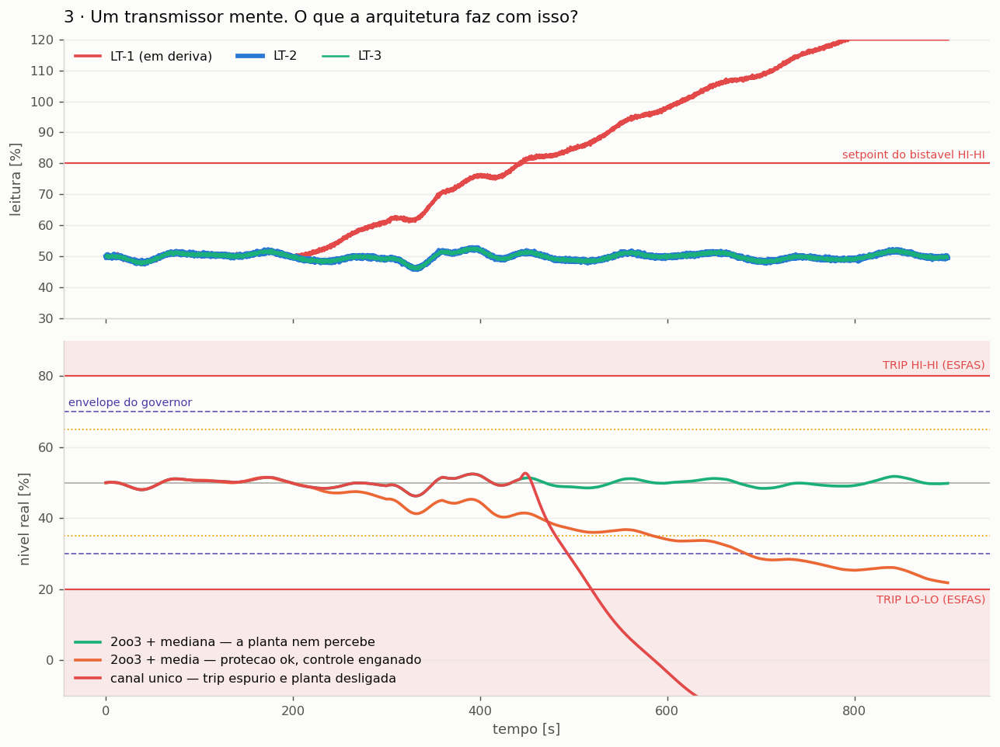

# AEGIS-SG — IA no controle, engenharia na segurança

**Um agente de IA controla o nível de um gerador de vapor. Uma camada
determinística garante que ele nunca chegue perto de desligar a planta.**

> **In English —** An RL/MPC agent controls steam-generator level on a
> non-minimum-phase plant, while a deterministic runtime-assurance layer
> (safety envelope + short-horizon prediction + Simplex reversion) keeps it
> away from the protection setpoints. The protection layer itself (RPS/ESFAS,
> 2oo3 voting, latching) contains no AI and is validated by test, in the shape
> of a safety-instrumented-function argument. The question is not whether AI
> can be SIL-rated — it is *where AI may sit* so the plant gets better without
> the safety case getting worse.

Projeto de conceito na fronteira entre controle avançado, aprendizado de
máquina e segurança funcional (IEC 61508 / IEC 61511 / ISO-IEC TR 5469).

---

## A pergunta

Aprendizado por reforço já bate controladores clássicos em desempenho.
Mas nenhuma autoridade certificadora vai aceitar uma rede neural dentro de
uma função instrumentada de segurança — e está certa: não se demonstra
capacidade sistemática de um objeto cujo comportamento fora da
distribuição de treino é, por construção, desconhecido.

A pergunta não é *"IA pode ser SIL 3?"*. É:

> **Onde a IA pode ficar, para que a planta fique melhor sem que o
> argumento de segurança fique pior?**

## A tese

Três camadas, com independência entre elas:

```
                       demanda de carga
                              │
   ┌──────────────────────────▼──────────────────────────┐
   │  CAMADA 1 · CONTROLE            (não relacionada à segurança)
   │  agente de RL / MPC — otimiza desempenho             │
   └──────────────────────────┬──────────────────────────┘
                              │ ação candidata
   ┌──────────────────────────▼──────────────────────────┐
   │  CAMADA 2 · GARANTIA EM TEMPO DE EXECUÇÃO           │
   │  envelope + previsão de 45 s + reversão (Simplex)   │
   │  determinística · sem IA · testável exaustivamente  │
   └──────────────────────────┬──────────────────────────┘
                              │ ação aplicada
   ┌──────────────────────────▼──────────────────────────┐
   │  PLANTA — gerador de vapor (fase não-mínima)         │
   └──────────────────────────┬──────────────────────────┘
                              │ 3 transmissores redundantes
   ┌──────────────────────────▼──────────────────────────┐
   │  CAMADA 3 · PROTEÇÃO — RPS / ESFAS                  │
   │  bistáveis + votação 2oo3 + latch · NUNCA contém IA │
   └─────────────────────────────────────────────────────┘
```

A camada 2 age **antes** do limite de segurança, para que a camada 3 nunca
precise agir. As duas coisas que este projeto insiste em separar:

| | Camada 2 (governor) | Camada 3 (ESFAS) |
|---|---|---|
| quando age | antes da violação | depois |
| o que preserva | disponibilidade | integridade |
| se agir | você perdeu desempenho | você perdeu a planta |

**Um trip é um sucesso da proteção e um fracasso do controle.**

## A planta

Nível *narrow-range* de um gerador de vapor, com **shrink & swell**: abrir a
válvula de água de alimentação faz o nível **cair** antes de subir. A planta
é de fase não-mínima — zero em `s = +1/6 s⁻¹` — e é justamente por isso
que ela é interessante:

- quebra sintonia por tentativa e erro;
- quebra RL de horizonte curto, que aprende a correlação invertida;
- é uma das maiores causas de trip espúrio em plantas reais.

A condição está codificada e testada: `K_sw > K_m · τ_sw`
(`aegis/plant.py::zero_nao_minimo`). Se ela cair, o projeto perde o objeto.

## Resultados de hoje

Rejeição de carga severa (100 % → 45 % em 25 s):

| | linha de base | agente sozinho | **agente + governor** |
|---|---:|---:|---:|
| IAE [%·s] | 1564 | 12117 | **1219** |
| desvio máximo [%] | 14,4 | 55,4 | **8,4** |
| margem mínima ao trip [%] | 15,6 | −25,4 | **21,6** |
| trips | 0 | **1** | **0** |
| tempo sob o agente [%] | — | 100 | 95 |

Em carga normal, o agente e o controlador aprovado são **numericamente
idênticos** (IAE 824,97 nos dois). É esse o ponto: a política passa em
qualquer teste de aceitação e falha exatamente onde ninguém testou.

Com a camada de garantia, ela entrega **mais desempenho e mais margem de
segurança que a linha de base** — porque a contenção existe.



Um transmissor em deriva, três arquiteturas:

- **2oo3 + mediana** — o instrumento sobe 70 % e a planta nem percebe;
- **2oo3 + média** — a proteção resiste, mas o *controle* é enganado e o
  nível real desce até **1,8 % do setpoint de trip**;
- **canal único** — trip espúrio aos 442 s.

A votação protege contra o trip espúrio. Ela **não** protege contra a
agregação errada na camada de controle.

## Rodar

```bash
pip install -r requirements.txt
python scripts/run_scenarios.py     # métricas + figuras em figs/
pytest -q                           # 14 casos de validação da proteção
```

## Estrutura

```
aegis/plant.py        modelo do gerador de vapor (shrink & swell)
aegis/sensors.py      3 transmissores redundantes + modos de falha
aegis/protection.py   RPS/ESFAS: bistáveis, 2oo3, latch, tempo de resposta
aegis/controllers.py  PID a três elementos (linha de base) + agente proxy
aegis/governor.py     envelope, previsão e reversão (arquitetura Simplex)
aegis/env.py          ambiente Gymnasium com o governor no laço (shielded RL)
aegis/simulator.py    laço de simulação e perfis de carga
tests/                a camada de proteção testada como uma SIF
```

## Próximos passos

1. MPC com restrições rígidas no envelope, como teto de desempenho.
2. SAC/PPO treinado **com** o governor no laço; veto entra na recompensa.
3. Campanha de ensaios: matriz de cenários × sementes; métricas de segurança
   reportadas separadamente das de desempenho.
4. Servidor OPC UA expondo processo e diagnóstico.
5. Caso de segurança: alocação de funções por camada, independência,
   modos de falha do modelo e o que *não* é reivindicado.

## Referências

- IEC 61508 / IEC 61511 — segurança funcional; SIL, independência de camadas.
- ISO/IEC TR 5469:2024 — *Artificial intelligence — Functional safety and AI systems*.
- IEC 61513 — I&C de segurança em instalações nucleares; defesa em profundidade.
- Sha, L. (2001) — *Using simplicity to control complexity* (arquitetura Simplex).

> Modelo de ordem reduzida, não vinculado a nenhuma planta específica.
> Fins de estudo e demonstração de arquitetura.
